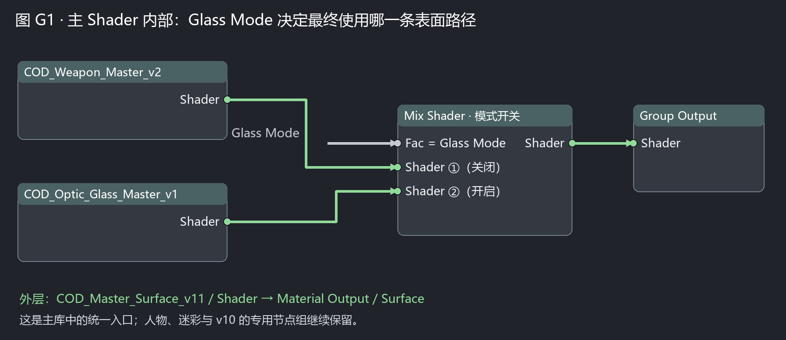
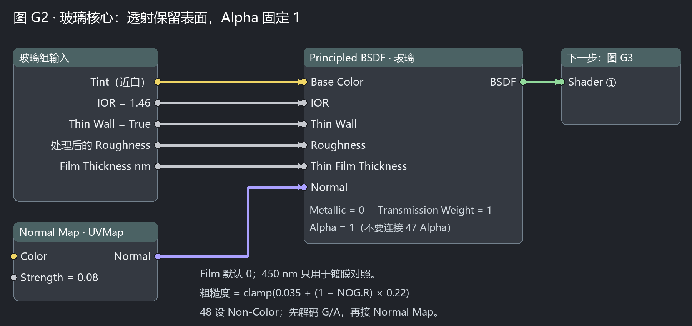
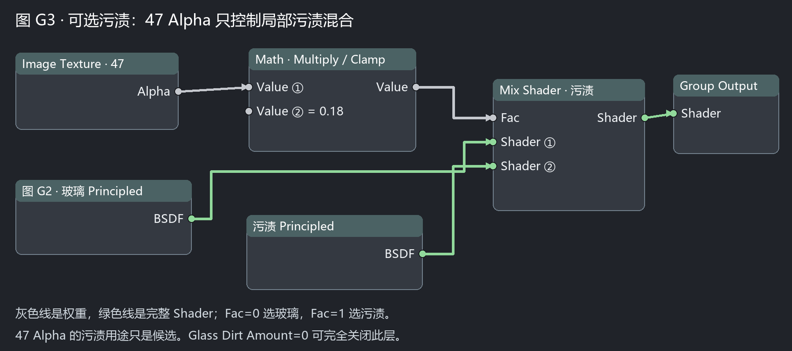

# 瞄准镜薄壁玻璃 v11：通道、开关与镀膜

全息瞄准镜光学玻璃的候选实现：辨认薄片与重合层、理解通道含义、用一个开关在统一主组里切换不透明与玻璃路径，并分开控制污渍与镀膜。对应节点组 `COD_Optic_Glass_Master_v1` 与 `COD_Master_Surface_v11`，均在 [shaders/ez4cywa_COD_Shader_Library.blend](../shaders/ez4cywa_COD_Shader_Library.blend)（21 组）。

> 本教程改写自研究项目的 TUTORIAL.md 第 19–24 章；通道图、受控对照渲染图与完整证据链保留在私密研究仓库（`docs/holo-glass-source-evidence.md`）。文中参数为研究候选值，不是游戏常量。

## 1. 先辨认薄片与重合层

导入瞄准镜资产后有 6 块网格：Holo_03、Holo_04 是两块斜置薄片，每块只有 32 条边界边——**不是封闭实体玻璃**，必须按开放薄片处理。Holo_01、Holo_04、Holo_05 顶点与面索引完全重合：演示仅保留 Holo_04，Holo_01（没有导出准星图的 stencil 层）与 Holo_05（另一材质的重合层）隐藏但未删除；把三层同时当实体玻璃会重复计算表面。

源素材中材质 hash `308ac7c511b75c13` 与 `62635be0e042fff5` 都引用 thermalmap，但**热成像图不等于可见光透射图**，没有接到透射或污渍。游戏内分层用途、精确镀膜参数和准星运行时输入仍未恢复；本次没有素材恢复准星纹理，因此没有造红点冒充原准星。

## 2. 看通道：黑色镜片图不等于黑玻璃

后镜片 47 图的中心 RGB 接近黑色。若直接把它作为透射玻璃 Tint，背景会被压暗；本方案让 **Glass Tint 独立使用近白色**。47 RGB 仍可连统一组 Base Color，只有不透明路径读取它，玻璃路径不读取这个底色输入。

47 Alpha 中心为 0、边缘有纹理，本轮仅作为**可关闭的污渍覆盖候选**，不能据此宣称它就是游戏透明度。玻璃本体 Alpha 始终为 1。另一张灰度图（4d，中心约 231）缺少绑定证据，因此没有接到 Alpha、透射或污渍。

48 使用 Non-Color；R 作为光泽候选，G/A 继续走既有 NOG 解码。局部粗糙度公式为：

```
clamp(Glass Roughness + (1 − R) × Glass Gloss Map Weight)
```

默认 `Roughness=0.035`、`Gloss Map Weight=0.22` 是本项目调参；`Gloss Map Weight=0` 可以关闭这张图对粗糙度的影响。

Image Texture 设 `Alpha Mode = Channel Packed`，48 的 Color 接 NOG RGB、Alpha 接 NOG Alpha。**不要把 48 原始彩色图直接接 Normal Map**——先经组内解码器得到 Decoded Normal，再进玻璃的 Normal Map / Color。法线强度默认 0.08，便于从平滑玻璃开始检查。

## 3. 主 Shader：一个开关选玻璃

原有 19 个节点组完整保留，增加玻璃组与统一入口后共 21 个。`COD_Master_Surface_v11` 把武器 v2 与玻璃接到同一个输出；人物、迷彩、v10 方向框架仍使用库内各自的专用组。



1. File → Append → 主库 → NodeTree → `COD_Master_Surface_v11`；或从资产浏览器直接拖入。Append 节点组不会自动分配给选中网格。

2. 添加两个 Image Texture：47 设 sRGB、48 设 Non-Color。47 Color → Base Color；47 Alpha → Color Alpha；48 Color → NOG RGB；48 Alpha → NOG Alpha。两张图的 Vector 都接 UV Map / UV（名称 `UVMap`）。

3. 镜片**开启 `Glass Mode`**，组的 Shader 输出接 Material Output / Surface。可选把 47 Alpha 再分一条线接 `Glass Dirt Mask`。`Glass Tint` 保持近白；不要把 47 黑色 RGB 接到它。

4. 外壳**关闭 `Glass Mode`**，继续走 `COD_Weapon_Master_v2` 分支。不透明路径的金属参数不支配玻璃路径。单独复用玻璃时，也可追加 `COD_Optic_Glass_Master_v1`，自行提供已解码法线与 Gloss R。

## 4. 玻璃核心：Thin Wall、透射与法线



进入主组再进入 `Optic glass surface`：Tint → Principled / Base Color；IOR → IOR；Thin Wall → Thin Wall。默认 `IOR=1.46`、`Metallic=0`、`Transmission Weight=1`、`Alpha=1`。**Transmission 是光穿过仍然存在的表面；Alpha 是表面覆盖是否存在，不能混用。**

Blender 5.2.2 提供原生 Thin Wall 输入，本模型开放薄片默认开启。若换成真正有厚度且封闭的镜片，再关闭 Thin Wall。不要仅为"玻璃更真实"给当前开放薄片加 Volume Absorption——它没有定义可用的内部路程。

粗糙度链：`Subtract(1, Gloss R)` → `Multiply(× Gloss Map Weight)` → `Add(+ 基础 Roughness, Clamp)` → Principled / Roughness。

法线链：已有武器解码输出 Decoded Normal → 玻璃组 Normal Color → Normal Map / Color；`Glass Normal Strength` → Strength；Normal Map 用 Tangent Space + `UVMap` → Principled / Normal。同一法线还供污渍表面使用，避免两层细节方向脱节。

官方依据：[Principled BSDF 5.2](https://docs.blender.org/manual/sr/5.2/render/shader_nodes/shader/principled.html)。本教程以 Cycles 为基准；EEVEE 的薄壁还需检查 Thickness=0 与 Slab，薄膜效果不能承诺与 Cycles 相同。

## 5. 污渍与镀膜：分开控制



`Glass Dirt Mask × Glass Dirt Amount` → Math Multiply（Clamp）→ Mix Shader / Fac。Fac=0 是玻璃，Fac=1 是污渍。污渍是另一颗不透明 Principled（`Roughness=0.65`，颜色单独控制）。

默认 `Dirt Amount=0.18`，是温和的局部覆盖候选；设 0 可完全关闭。若整个镜片发白：先关闭污渍，再把 `Gloss Map Weight` 与 `Normal Strength` 分别归零排查；**不要通过降低 Alpha 去隐藏错误**。

镀膜：`Glass Film Thickness nm` → 玻璃 Principled / Thin Film Thickness；`Glass Film IOR` → Thin Film IOR。厚度单位纳米，默认 0 关闭；研究对照使用 450 nm、Film IOR=1.38，只用于观察干涉颜色，**不代表真实游戏镀膜**。Coat 与 Thin Film 作用不同，不要重复接同一张未知图"增强颜色"。

## 6. 固定机位验证（边界）

固定灯光与相机下的四组对照：A 薄壁默认、B 误用不透明、C 关闭薄壁、D 添加候选镀膜。A 能看见后方棋盘；B 变成不透明黑色表面；C 在开放薄片上采用实体折射假设、背景位置偏移；D 改变反射与透射颜色。**四图只说明接线与模型假设的影响，不能证明哪一项已匹配游戏**——继续定量匹配需要同模型游戏截图、机位、光照与运行时参数。

推荐渲染设置：Cycles，64 samples，Transmission bounces=12，总反弹 16，Transparent bounces=16，AgX 视图变换。交付场景恢复为 A（Film=0）。

核验口径（私密研究仓库 manifests）：24 个原文件哈希校验、23 项场景检查、主库原 19 组保存前后指纹一致。本仓库分发的主库即"19 + 玻璃 2 组 = 21 组"版本。

## 相关文档

- [教程总览](TUTORIALS_SUMMARY.md) · [cast 材质自动加载](AUTO_MATERIALS.md) · [Maya 2025 移植计划](MAYA_2025_PORT.md)
- 节点组目录与用法见 [README](../README.md#节点组目录)
